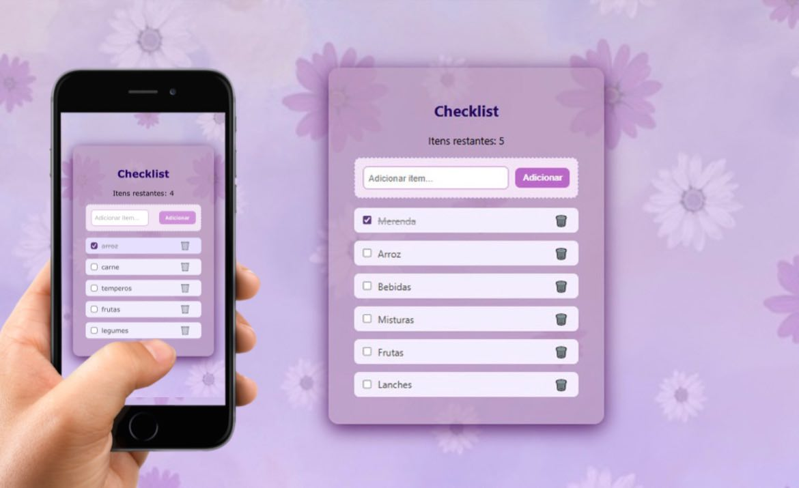

## 💻 Projeto
Esse é um projeto Web Responsivo de uma To-do List, útil para concluir tarefas do dia a dia.

## 🚀 Tecnologias 
Esse projeto foi desenvolvido para praticar minhas habilidades de Front-end com as seguintes tecnologias:

- HTML
- CSS
- JavaScript
- Git e Github
